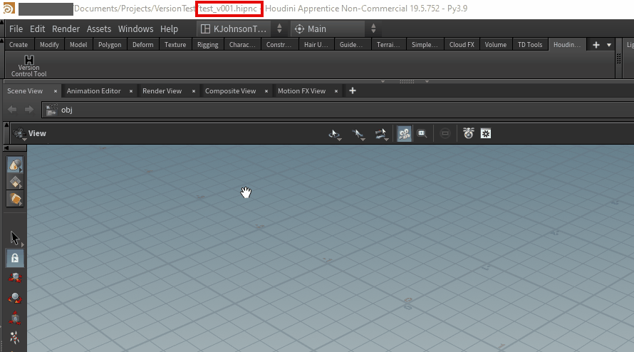

# Houdini Tools and Scripts

## Houdini Version Control Tool

The Houdini Version Control Tool allows a user to increment and save a Houdini file with a version suffix automatically. This can be done via the "File" main menu in the upper toolbar or through the shelf tool.

Features include:
* Auto-increment and save versions with _v### suffix (also works with _V### if that is existing format)
* Add default _v001 if file does not have version 
* User has option to overwrite or save as latest version if incremented version already exists
* Easily view a list of all versions of the current file via the shelf tool
* Seamlessly switch between versions by double-clicking to open desired version from the list
  


### Installation

1. Download the repo files and save anywhere. (Remember the path of where you saved)
    
    - You should delete the "img" folder which is only used for documentation
2. Find your user houdini files 
    
    - For Windows, it is usually in C:\Users\[yourUser]\Documents\houdini19.5

3. Create an empty folder in the houdini folder called "packages" (all lowercase) if it does not already exist
4. Inside this new folder, create a new "packages.json" file
    - The json file should include the path where you saved the tool files, like this:
    ```
    {
    "package_path": ["Insert path to tool files here"]
    }
    ```
    - You may use Houdini's included file paths depending on where you saved it. Ex: $HOME/Projects/HoudiniTools_KJ
6. Open your file in Houdini and add the new shelf tool  

- The name of this shelf is written in the ```default.shelf``` file under label (NOT NAME) and can be changed at any time.  

  ```
  <toolshelf name="houdini_tools_kj" label="Houdini Tools">
  ```
- If changed, make sure to remove the old shelf and add the newly named one.

The shelf contains the Version Control tool. In addition, the main menu should contain a new option "Save Version".  


